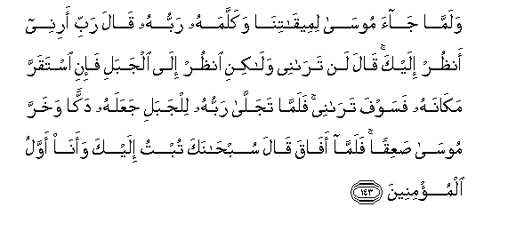

# وَلَمَّا جَاءَ مُوسَىٰ لِمِيقَاتِنَا وَكَلَّمَهُ رَبُّهُ قَالَ رَبِّ أَرِنِي أَنْظُرْ إِلَيْكَ ۚ قَالَ لَنْ تَرَانِي وَلَٰكِنِ انْظُرْ إِلَى الْجَبَلِ فَإِنِ اسْتَقَرَّ مَكَانَهُ فَسَوْفَ تَرَانِي ۚ فَلَمَّا تَجَلَّىٰ رَبُّهُ لِلْجَبَلِ جَعَلَهُ دَكًّا وَخَرَّ مُوسَىٰ صَعِقًا ۚ فَلَمَّا أَفَاقَ قَالَ سُبْحَانَكَ تُبْتُ إِلَيْكَ وَأَنَا أَوَّلُ الْمُؤْمِنِينَ 

##Walamma jaa moosa limeeqatina wakallamahu rabbuhu qala rabbi arinee anthur ilayka qala lan taranee walakini onthur ila aljabali fa-ini istaqarra makanahu fasawfa taranee falamma tajalla rabbuhu liljabali jaAAalahu dakkan wakharra moosa saAAiqan falamma afaqa qala subhanaka tubtu ilayka waana awwalu almu/mineena 

## 翻译(Translation)：

| Translator | 译文(Translation)                                            |
| :--------: | ------------------------------------------------------------ |
|    马坚    | 当穆萨为了我的会期而来，而且他的主对他说了话的时候，他说：我的主啊！求你昭示我，以便我看见你。主说：你不能看见我，但你看那座山吧。如果它能在它的本位上坚定，那末，你就能看见我。当他的主对那座山微露光华的时候，他使那座山变成粉碎的。穆萨晕倒在地上。当他苏醒的时候，他说：我赞颂你超绝万物，我向你悔罪，我是首先信道的。 |
|  YUSUFALI  | When Moses came to the place appointed by Us, and his Lord addressed him, He said: "O my Lord! show (Thyself) to me, that I may look upon thee." Allah said: "By no means canst thou see Me (direct); But look upon the mount; if it abide in its place, then shalt thou see Me." When his Lord manifested His glory on the Mount, He made it as dust. And Moses fell down in a swoon. When he recovered his senses he said: "Glory be to Thee! to Thee I turn in repentance, and I am the first to believe." |
| PICKTHALL  | And when Moses came to Our appointed tryst and his Lord had spoken unto him, he said: My Lord! Show me (Thy Self), that I may gaze upon Thee. He said: Thou wilt not see Me, but gaze upon the mountain! If it stand still in its place, then thou wilt see Me. And when his Lord revealed (His) glory to the mountain He sent it crashing down. And Moses fell down senseless. And when he woke he said: Glory unto Thee! I turn unto Thee repentant, and I am the first of (true) believers. |
|   SHAKIR   | And when Musa came at Our appointed time and his Lord spoke to him, he said: My Lord! show me (Thyself), so that I may look upon Thee. He said: You cannot (bear to) see Me but look at the mountain, if it remains firm in its place, then will you see Me; but when his Lord manifested His glory to the mountain He made it crumble and Musa fell down in a swoon; then when he recovered, he said: Glory be to Thee, I turn to Thee, and I am the first of the believers. |

---

## 对位释义(Words Interpretation)：

| No   | العربية | 中文    | English | 曾用词 |
| ---- | ------: | ------- | ------- | ------ |
| 序号 |    阿文 | Chinese | 英文    | Used   |
| 7:143.1  | وَلَمَّا     | 和当           | and when                | 见2:89.1   |
| 7:143.2  | جَاءَ      | 他来           | come                    | 见4:43.28  |
| 7:143.3  | مُوسَىٰ     | 穆萨           | Moses                   | 见2:51.3   |
| 7:143.4  | لِمِيقَاتِنَا | 至我们的约期   | to Our appointed time   |            |
| 7:143.5  | وَكَلَّمَهُ    | 和他对他说     | and he spoke to him     |            |
| 7:143.6  | رَبُّهُ      | 他的主         | His Lord                | 见2:124.4  |
| 7:143.7  | قَالَ      | 他说，         | He said                 | 见2:30.2   |
| 7:143.8  | رَبِّ       | 主，养育，调养 | Lord                    | 见1:2.3    |
| 7:143.9  | أَرِنِي     | 显示我         | show me                 | 见2:260.5  |
| 7:143.10 | أَنْظُرْ     | 我看见         | I may look              |            |
| 7:143.11 | إِلَيْكَ     | 至你           | to you                  | 见2:4.5    |
| 7:143.12 | قَالَ      | 他说，         | He said                 | 见2:30.2   |
| 7:143.13 | لَنْ       | 绝不           | will not                | 见2:55.5   |
| 7:143.14 | تَرَانِي    | 你看见我       | you can see Me          |            |
| 7:143.15 | وَلَٰكِنِ     | 并且但是       | and but                 | 见2:12.5   |
| 7:143.16 | انْظُرْ     | 你看           | See                     | 见4:50.1   |
| 7:143.17 | إِلَى      | 至             | to                      | 见2:14.9   |
| 7:143.18 | الْجَبَلِ    | 山             | the mountain            |            |
| 7:143.19 | فَإِنِ      | 然后如果       | then if                 | 见2:192.1  |
| 7:143.20 | اسْتَقَرَّ    | 它坚定         | it remains firm in      |            |
| 7:143.21 | مَكَانَهُ    | 它的位置       | its place               |            |
| 7:143.22 | فَسَوْفَ     | 然后将         | soon shall              | 见4:30.6   |
| 7:143.23 | تَرَانِي    | 你看见我       | you can see Me          | 见2:143.14 |
| 7:143.24 | فَلَمَّا     | 但是当         | but when                | 见2:17.6   |
| 7:143.25 | تَجَلَّىٰ     | 他显出光华     | he manifested His glory |            |
| 7:143.26 | رَبُّهُ      | 他的主         | His Lord                | 见2:124.4  |
| 7:143.27 | لِلْجَبَلِ    | 至山           | to the mountain         | 参7:143.18 |
| 7:143.28 | جَعَلَهُ     | 他使它         | make it                 | 见3:126.2  |
| 7:143.29 | دَكًّا      | 粉碎           | crumble                 |            |
| 7:143.30 | وَخَرَّ      | 和他倒         | and he fell down        |            |
| 7:143.31 | مُوسَىٰ     | 穆萨           | Moses                   | 见2:51.3   |
| 7:143.32 | صَعِقًا     | 无知觉         | senseless               |            |
| 7:143.33 | فَلَمَّا     | 但是当         | but when                | 见2:17.6   |
| 7:143.34 | أَفَاقَ     | 他苏醒         | he recovered            |            |
| 7:143.35 | قَالَ      | 他说，         | He said                 | 见2:30.2   |
| 7:143.36 | سُبْحَانَكَ   | 赞你超绝       | Glory be to you         | 见2:32.2   |
| 7:143.37 | تُبْتُ      | 我悔罪         | I repented              | 见4:18.13  |
| 7:143.38 | إِلَيْكَ     | 至你           | to you                  | 见2:4.5    |
| 7:143.39 | وَأَنَا     | 和我是         | and I am                | 见2:160.9  |
| 7:143.40 | أَوَّلُ      | 首先           | the first               | 见6:163.7  |
| 7:143.41 | الْمُؤْمِنِينَ | 信士们         | the believers           | 见2:223.16 |

---