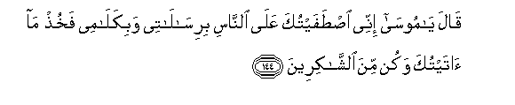

#قَالَ يَا مُوسَىٰ إِنِّي اصْطَفَيْتُكَ عَلَى النَّاسِ بِرِسَالَاتِي وَبِكَلَامِي فَخُذْ مَا آتَيْتُكَ وَكُنْ مِنَ الشَّاكِرِينَ 

##Qala ya moosa innee istafaytuka AAala alnnasi birisalatee wabikalamee fakhuth ma ataytuka wakun mina alshshakireena 

## 翻译(Translation)：

| Translator | 译文(Translation)                                            |
| :--------: | ------------------------------------------------------------ |
|    马坚    | 主说：穆萨啊！我确已借我的使命和面谕而将你选拔在众人之上了，你要接受我所赐你的恩惠，并当感谢我。 |
|  YUSUFALI  | (Allah) said: "O Moses! I have chosen thee above (other) men, by the mission I (have given thee) and the words I (have spoken to thee): take then the (revelation) which I give thee, and be of those who give thanks." |
| PICKTHALL  | He said: O Moses! I have preferred thee above mankind by My messages and by My speaking (unto thee). So hold that which I have given thee, and be among the thankful. |
|   SHAKIR   | He said: O Musa! surely I have chosen you above the people with My messages and with My words, therefore take hold of what I give to you and be of the grateful ones. |

---

## 对位释义(Words Interpretation)：

| No   | العربية | 中文    | English | 曾用词 |
| ---- | ------: | ------- | ------- | ------ |
| 序号 |    阿文 | Chinese | 英文    | Used   |
| 7:144.1  | قَالَ      | 他说，       | He said            | 见2:30.2   |
| 7:144.2  | يَا       | 啊           | Oh                 | 见2:21.1   |
| 7:144.3  | مُوسَىٰ     | 穆萨         | Moses              | 见2:51.3   |
| 7:144.4  | إِنِّي      | 确实我       | surely I           | 见2:30.5   |
| 7:144.5  | اصْطَفَيْتُكَ  | 我拣选你     | I have chosen you  |            |
| 7:144.6  | عَلَى      | 至           | On                 | 见2:5.2    |
| 7:144.7  | النَّاسِ    | 人           | People             | 见2:8.2    |
| 7:144.8  | بِرِسَالَاتِي | 在我的使命   | by My messages     |            |
| 7:144.9  | وَبِكَلَامِي  | 和在我的说话 | and by My speaking |            |
| 7:144.10 | فَخُذْ      | 然后取       | then take          | 见2:260.18 |
| 7:144.11 | مَا       | 什么         | what/ that which   | 见2:17.8   |
| 7:144.12 | آتَيْتُكَ    | 我给你       | I give to you      |            |
| 7:144.13 | وَكُنْ      | 和是         | and Be             | 参2:117.10 |
| 7:144.14 | مِنَ       | 从           | from               | 见2:19.3   |
| 7:144.15 | الشَّاكِرِينَ | 众感谢者     | the thankful       | 见3:144.27 |

---