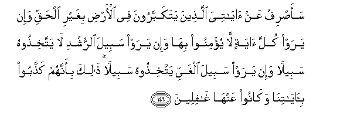

# سَأَصْرِفُ عَنْ آيَاتِيَ الَّذِينَ يَتَكَبَّرُونَ فِي الْأَرْضِ بِغَيْرِ الْحَقِّ وَإِنْ يَرَوْا كُلَّ آيَةٍ لَا يُؤْمِنُوا بِهَا وَإِنْ يَرَوْا سَبِيلَ الرُّشْدِ لَا يَتَّخِذُوهُ سَبِيلًا وَإِنْ يَرَوْا سَبِيلَ الْغَيِّ يَتَّخِذُوهُ سَبِيلًا ۚ ذَٰلِكَ بِأَنَّهُمْ كَذَّبُوا بِآيَاتِنَا وَكَانُوا عَنْهَا غَافِلِينَ 

##Saasrifu AAan ayatiya allatheena yatakabbaroona fee al-ardi bighayri alhaqqi wa-in yaraw kulla ayatin layu/minoo biha wa-in yaraw sabeela alrrushdi la yattakhithoohu sabeelan wa-in yaraw sabeela alghayyi yattakhithoohu sabeelan thalika bi-annahum kaththaboo bi-ayatina wakanoo AAanha ghafileena 

## 翻译(Translation)：

| Translator | 译文(Translation)                                            |
| :--------: | ------------------------------------------------------------ |
|    马坚    | 我将使那些在地方上妄自尊大的人离弃我的迹象，即使他们看见一切迹象，他们也不信它；如果他们看见正道，他们不把它当作道路；如果他们看见邪道，他们把它当作道路。这是因为他们不信我的迹象，而且忽视它。 |
|  YUSUFALI  | Those who behave arrogantly on the earth in defiance of right - them will I turn away from My signs: Even if they see all the signs, they will not believe in them; and if they see the way of right conduct, they will not adopt it as the way; but if they see the way of error, that is the way they will adopt. For they have rejected our signs, and failed to take warning from them. |
| PICKTHALL  | I shall turn away from My revelations those who magnify themselves wrongfully in the earth, and if they see each token believe it not, and if they see the way of righteousness choose it nor for (their) way, and if they see the way of error choose if for (their) way. That is because they deny Our revelations and are used to disregard them. |
|   SHAKIR   | I will turn away from My communications those who are unjustly proud in the earth; and if they see every sign they will not believe in It; and if they see the way of rectitude they do not take It for a way, and if they see the way of error. they take it for a way; this is because they rejected Our communications and were heedless of them. |

---

## 对位释义(Words Interpretation)：

| No   | العربية | 中文    | English | 曾用词 |
| ---- | ------: | ------- | ------- | ------ |
| 序号 |    阿文 | Chinese | 英文    | Used   |
| 7:146.1  | سَأَصْرِفُ   | 我将使离开     | I shall turn away   |            |
| 7:146.2  | عَنْ      | 从             | on                  | 见2:48.6   |
| 7:146.3  | آيَاتِيَ   | 我的众迹象     | My signs            |            |
| 7:146.4  | الَّذِينَ   | 谁，那些       | those who           | 见2:6.2    |
| 7:146.5  | يَتَكَبَّرُونَ | 他们妄自尊大   | they are arrogantly |            |
| 7:146.6  | فِي      | 在             | in                  | 见2:10.1   |
| 7:146.7  | الْأَرْضِ   | 大地           | Earth               | 见2:22.4   |
| 7:146.8  | بِغَيْرِ    | 在没有         | without             | 见2:61.54  |
| 7:146.9  | الْحَقِّ    | 正确的，真理   | Right, truth        | 见2:26.17  |
| 7:146.10 | وَإِنْ     | 和如果         | and if              | 见2:23.1   |
| 7:146.11 | يَرَوْا    | 他们看见       | they see            | 见6:6.2    |
| 7:146.12 | كُلَّ      | 所有           | All                 | 见2:20.23  |
| 7:146.13 | آيَةٍ     | 迹象           | the Signs           | 见2:106.4  |
| 7:146.14 | لَا      | 不，不是，没有 | no                  | 见2:2.3    |
| 7:146.15 | يُؤْمِنُوا  | 他们归信       | They believe        | 见2:75.3   |
| 7:146.16 | بِهَا     | 在他们         | in them             | 见2:99.8   |
| 7:146.17 | وَإِنْ     | 和如果         | and if              | 见2:23.1   |
| 7:146.18 | يَرَوْا    | 他们看见       | they see            | 见6:6.2    |
| 7:146.19 | سَبِيلَ    | 道路           | the way             | 见7:142.22 |
| 7:146.20 | الرُّشْدِ   | 正的           | rectitude           |            |
| 7:146.21 | لَا      | 不，不是，没有 | no                  | 见2:2.3    |
| 7:146.22 | يَتَّخِذُوهُ  | 他们采取它     | they take it        |            |
| 7:146.23 | سَبِيلًا   | 道路           | a way               | 见3:97.18  |
| 7:146.24 | وَإِنْ     | 和如果         | and if              | 见2:23.1   |
| 7:146.25 | يَرَوْا    | 他们看见       | they see            | 见6:6.2    |
| 7:146.26 | سَبِيلَ    | 道路           | the way             | 见7:142.22 |
| 7:146.27 | الْغَيِّ    | 错的           | Error               | 见2:256.9  |
| 7:146.28 | يَتَّخِذُوهُ  | 他们采取它     | they take it        | 见7:146.22 |
| 7:146.29 | سَبِيلًا   | 道路           | a way               | 见3:97.18  |
| 7:146.30 | ذَٰلِكَ     | 这个           | this                | 见2:2.1    |
| 7:146.31 | بِأَنَّهُمْ   | 因为那个他们   | That they are       | 见2:61.47  |
| 7:146.32 | كَذَّبُوا   | 他们否认       | they denied         | 见3:11.7   |
| 7:146.33 | بِآيَاتِنَا | 在我们的迹象   | in Our signs        | 见2:39.4   |
| 7:146.34 | وَكَانُوا  | 和他们是       | and they were       | 见2:61.59  |
| 7:146.35 | عَنْهَا    | 从它           | from it             | 见2:36.3   |
| 7:146.36 | غَافِلِينَ  | 忽视           | heedless            | 见7:136.11 |

---