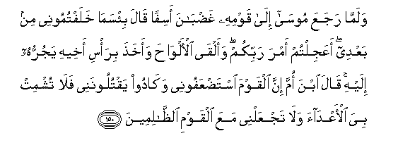

# وَلَمَّا رَجَعَ مُوسَىٰ إِلَىٰ قَوْمِهِ غَضْبَانَ أَسِفًا قَالَ بِئْسَمَا خَلَفْتُمُونِي مِنْ بَعْدِي ۖ أَعَجِلْتُمْ أَمْرَ رَبِّكُمْ ۖ وَأَلْقَى الْأَلْوَاحَ وَأَخَذَ بِرَأْسِ أَخِيهِ يَجُرُّهُ إِلَيْهِ ۚ قَالَ ابْنَ أُمَّ إِنَّ الْقَوْمَ اسْتَضْعَفُونِي وَكَادُوا يَقْتُلُونَنِي فَلَا تُشْمِتْ بِيَ الْأَعْدَاءَ وَلَا تَجْعَلْنِي مَعَ الْقَوْمِ الظَّالِمِينَ 

##Walamma rajaAAa moosa ila qawmihi ghadbana asifan qala bi/sama khalaftumoonee min baAAdee aAAajiltum amra rabbikum waalqa al-alwaha waakhatha bira/si akheehi yajurruhu ilayhi qala ibna omma inna alqawma istadAAafoonee wakadoo yaqtuloonanee fala tushmit biya al-aAAdaa wala tajAAalnee maAAa alqawmi alththalimeena 

## 翻译(Translation)：

| Translator | 译文(Translation)                                            |
| :--------: | ------------------------------------------------------------ |
|    马坚    | 当穆萨愤怒而又悲伤地去见他的宗族的时候，他说：我不在的时候，你们替我做的事真恶劣！难道你们不能静候你们主的命令吗？他扔了法版，揪住他哥哥的头发，把他拉到身边。他说：胞弟啊！宗族们确已欺负我，他们几乎杀害了我，你不要使我的仇敌称快，不要把我当作不义者。 |
|  YUSUFALI  | When Moses came back to his people, angry and grieved, he said: "Evil it is that ye have done in my place in my absence: did ye make haste to bring on the judgment of your Lord?" He put down the tablets, seized his brother by (the hair of) his head, and dragged him to him. Aaron said: "Son of my mother! the people did indeed reckon me as naught, and went near to slaying me! Make not the enemies rejoice over my misfortune, nor count thou me amongst the people of sin." |
| PICKTHALL  | And when Moses returned unto his people, angry and grieved, he said: Evil is that (course) which ye took after I had left you. Would ye hasten on the judgment of your Lord? And he cast down the tablets, and he seized his brother by the head, dragging him toward him. He said: Son of my mother! Lo! the folk did judge me weak and almost killed me. Oh, make not mine enemies to triumph over me and place me not among the evil-doers. |
|   SHAKIR   | And when Musa returned to his people, wrathful (and) in violent grief, he said: Evil is it that you have done after me; did you turn away from the bidding of your Lord? And he threw down the tablets and seized his brother by the head, dragging him towards him. He said: Son of my mother! surely the people reckoned me weak and had well-nigh slain me, therefore make not the enemies to rejoice over me and count me not among the unjust people. |

---

## 对位释义(Words Interpretation)：

| No   | العربية | 中文    | English | 曾用词 |
| ---- | ------: | ------- | ------- | ------ |
| 序号 |    阿文 | Chinese | 英文    | Used   |
| 7:150.1  | وَلَمَّا      | 和当           | and when              | 见2:89.1   |
| 7:150.2  | رَجَعَ       | 他返回         | he returned           |            |
| 7:150.3  | مُوسَىٰ      | 穆萨           | Moses                 | 见2:51.3   |
| 7:150.4  | إِلَىٰ       | 至             | to                    | 见2:14.9   |
| 7:150.5  | قَوْمِهِ      | 他的宗族       | his people            | 见6:83.6   |
| 7:150.6  | غَضْبَانَ     | 愤怒           | angry                 |            |
| 7:150.7  | أَسِفًا      | 忧伤           | grieved               |            |
| 7:150.8  | قَالَ       | 他说，         | He said               | 见2:30.2   |
| 7:150.9  | بِئْسَمَا     | 它真恶劣       | Evil is that          | 见2:90.1   |
| 7:150.10 | خَلَفْتُمُونِي  | 你们做         | you have done         |            |
| 7:150.11 | مِنْ        | 从             | from                  | 见2:4.8    |
| 7:150.12 | بَعْدِي      | 我之后         | after me              | 见2:133.14 |
| 7:150.13 | أَعَجِلْتُمْ    | 你们不静候吗？ | did you make haste    |            |
| 7:150.14 | أَمْرَ       | 命令           | the judgment          |            |
| 7:150.15 | رَبِّكُمْ      | 你们的主       | Your Lord             | 见2:21.5   |
| 7:150.16 | وَأَلْقَى     | 和他扔下       | and he threw down     |            |
| 7:150.17 | الْأَلْوَاحَ   | 众法版         | the tablets           | 参7:145.4  |
| 7:150.18 | وَأَخَذَ      | 他取           | he take               | 见3:81.2   |
| 7:150.19 | بِرَأْسِ      | 在头           | by the head           |            |
| 7:150.20 | أَخِيهِ      | 他兄弟         | his brother           | 见2:178.20 |
| 7:150.21 | يَجُرُّهُ      | 他拖他         | dragging him          |            |
| 7:150.22 | إِلَيْهِ      | 至他           | to him                | 见2:28.12  |
| 7:150.23 | قَالَ       | 他说，         | He said               | 见2:30.2   |
| 7:150.24 | ابْنَ       | 儿子           | Son                   | 见2:87.11  |
| 7:150.25 | أُمَّ        | 母亲           | the Mother            | 见6:92.10  |
| 7:150.26 | إِنَّ        | 的确           | surely                | 见2:6.1    |
| 7:150.27 | الْقَوْمَ     | 人们           | folk                  | 见2:250.14 |
| 7:150.28 | اسْتَضْعَفُونِي | 他们欺侮我     | they reckoned me weak |            |
| 7:150.29 | وَكَادُوا    | 和几乎         | and almost            | 参2:71.23  |
| 7:150.30 | يَقْتُلُونَنِي  | 他们杀害我     | they killed me        |            |
| 7:150.31 | فَلَا       | 因此不         | shall not             | 见2:22.18  |
| 7:150.32 | تُشْمِتْ      | 你使称快       | you make rejoice      |            |
| 7:150.33 | بِيَ        | 在我           | over me               |            |
| 7:150.34 | الْأَعْدَاءَ   | 众敌人         | the enemies           |            |
| 7:150.35 | وَلَا       | 也不           | and not               | 见1:7.8    |
| 7:150.36 | تَجْعَلْنِي    | 你置我         | you place me          |            |
| 7:150.37 | مَعَ        | 共同           | With                  | 见2:43.6   |
| 7:150.38 | الْقَوْمِ     | 人们           | folk                  | 见2:250.14 |
| 7:150.39 | الظَّالِمِينَ  | 不义的人       | unjust                | 见2:35.19  |

---