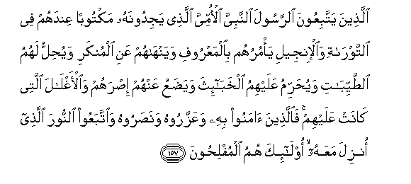

# الَّذِينَ يَتَّبِعُونَ الرَّسُولَ النَّبِيَّ الْأُمِّيَّ الَّذِي يَجِدُونَهُ مَكْتُوبًا عِنْدَهُمْ فِي التَّوْرَاةِ وَالْإِنْجِيلِ يَأْمُرُهُمْ بِالْمَعْرُوفِ وَيَنْهَاهُمْ عَنِ الْمُنْكَرِ وَيُحِلُّ لَهُمُ الطَّيِّبَاتِ وَيُحَرِّمُ عَلَيْهِمُ الْخَبَائِثَ وَيَضَعُ عَنْهُمْ إِصْرَهُمْ وَالْأَغْلَالَ الَّتِي كَانَتْ عَلَيْهِمْ ۚ فَالَّذِينَ آمَنُوا بِهِ وَعَزَّرُوهُ وَنَصَرُوهُ وَاتَّبَعُوا النُّورَ الَّذِي أُنْزِلَ مَعَهُ ۙ أُولَٰئِكَ هُمُ الْمُفْلِحُونَ 

##Allatheena yattabiAAoona alrrasoola alnnabiyya al-ommiyya allathee yajidoonahu maktooban AAindahum fee alttawrati waal-injeeli ya/muruhum bialmaAAroofi wayanhahum AAani almunkari wayuhillu lahumu alttayyibati wayuharrimu AAalayhimu alkhaba-itha wayadaAAu AAanhum israhum waal-aghlala allatee kanat AAalayhim faallatheena amanoo bihi waAAazzaroohu wanasaroohu waittabaAAoo alnnoora allathee onzila maAAahu ola-ika humu almuflihoona 

## 翻译(Translation)：

| Translator | 译文(Translation)                                            |
| :--------: | ------------------------------------------------------------ |
|    马坚    | 他们顺从使者--不识字的先知，他们在自己所有的《讨拉特》和《引支勒》中发现关于他的记载。他命令他们行善，禁止他们作恶，准许他们吃佳美的食物，禁戒他们吃污秽的食物，卸脱他们的重担，解除他们的桎梏，故凡信仰他，尊重他，援助他，而且遵循与他一起降临的光明的人，都是成功者。 |
|  YUSUFALI  | "Those who follow the messenger, the unlettered Prophet, whom they find mentioned in their own (scriptures),- in the law and the Gospel;- for he commands them what is just and forbids them what is evil; he allows them as lawful what is good (and pure) and prohibits them from what is bad (and impure); He releases them from their heavy burdens and from the yokes that are upon them. So it is those who believe in him, honour him, help him, and follow the light which is sent down with him,- it is they who will prosper." |
| PICKTHALL  | Those who follow the messenger, the Prophet who can neither read nor write, whom they will find described in the Torah and the Gospel (which are) with them. He will enjoin on them that which is right and forbid them that which is wrong. He will make lawful for them all good things and prohibit for them only the foul; and he will relieve them of their burden and the fetters that they used to wear. Then those who believe in him, and honour him, and help him, and follow the light which is sent down with him: they are the successful. |
|   SHAKIR   | Those who follow the Messenger-Prophet, the Ummi, whom they find written down with them in the Taurat and the Injeel (who) enjoins them good and forbids them evil, and makes lawful to them the good things and makes unlawful to them impure things, and removes from them their burden and the shackles which were upon them; so (as for) those who believe in him and honor him and help him, and follow the light which has been sent down with him, these it is that are the successful. |

---

## 对位释义(Words Interpretation)：

| No   | العربية | 中文    | English | 曾用词 |
| ---- | ------: | ------- | ------- | ------ |
| 序号 |    阿文 | Chinese | 英文    | Used   |
| 7:157.1  | الَّذِينَ    | 谁，那些               | those who           | 见2:6.2    |
| 7:157.2  | يَتَّبِعُونَ   | 他顺从                 | he follow           | 见4:27.8   |
| 7:157.3  | الرَّسُولَ   | 使者                   | the messenger       | 见2:143.10 |
| 7:157.4  | النَّبِيَّ    | 先知                   | the Prophet         |            |
| 7:157.5  | الْأُمِّيَّ    | 不识字的               | the unlettered      |            |
| 7:157.6  | الَّذِي     | 谁                     | who                 | 见2:17.3   |
| 7:157.7  | يَجِدُونَهُ   | 他们发现它             | they find it        |            |
| 7:157.8  | مَكْتُوبًا   | 被写                   | written             |            |
| 7:157.9  | عِنْدَهُمْ    | 他们那里               | with them           |            |
| 7:157.10 | فِي       | 在                     | in                  | 见2:10.1   |
| 7:157.11 | التَّوْرَاةِ  | 讨拉特                 | the Torah           | 见3:50.6   |
| 7:157.12 | وَالْإِنْجِيلِ | 和引支勒               | and the Injeel      | 参5:47.3   |
| 7:157.13 | يَأْمُرُهُمْ   | 他命令他们             | he commands them    |            |
| 7:157.14 | بِالْمَعْرُوفِ | 依照惯例               | according to usage  | 见2:178.23 |
| 7:157.15 | وَيَنْهَاهُمْ  | 和他禁止他们           | and he forbids them |            |
| 7:157.16 | عَنِ       | 关于                   | about               | 见2:189.2  |
| 7:157.17 | الْمُنْكَرِ   | 恶                     | the wrong           | 见3:104.11 |
| 7:157.18 | وَيُحِلُّ     | 和他使合法             | and he makes lawful |            |
| 7:157.19 | لَهُمُ      | 对他们                 | for them            | 见2:11.3   |
| 7:157.20 | الطَّيِّبَاتِ  | 众佳美事情             | all good things     |            |
| 7:157.21 | وَيُحَرِّمُ    | 和他禁止               | and he prohibits    |            |
| 7:157.22 | عَلَيْهِمُ    | 在他们                 | on they             | 见1:7.4    |
| 7:157.23 | الْخَبَائِثَ  | 众不洁事情             | impure things       |            |
| 7:157.24 | وَيَضَعُ     | 和他移除               | and he removes      |            |
| 7:157.25 | عَنْهُمْ     | 在他们                 | on them             | 见3:10.6   |
| 7:157.26 | إِصْرَهُمْ    | 他们的重担             | their burden        |            |
| 7:157.27 | وَالْأَغْلَالَ | 和众桎梏               | and the fetters     |            |
| 7:157.28 | الَّتِي     | 哪                     | Which               | 见2:24.8   |
| 7:157.29 | كَانَتْ     | 她是                   | she was             | 见2:94.3   |
| 7:157.30 | عَلَيْهِمْ    | 在他们                 | on they             | 见1:7.4    |
| 7:157.31 | فَالَّذِينَ   | 因此那些人             | so those who        | 见3:195.17 |
| 7:157.32 | آمَنُوا    | 诚信                   | believe             | 见2:9.4    |
| 7:157.33 | بِهِ       | 以它                   | with it             | 见2:22.13  |
| 7:157.34 | وَعَزَّرُوهُ   | 和尊重他               | and honour him      |            |
| 7:157.35 | وَنَصَرُوهُ   | 和援助他               | and help him        |            |
| 7:157.36 | وَاتَّبَعُوا  | 和他们追随             | And they followed   | 见2:102.1  |
| 7:157.37 | النُّورَ    | 光明                   | the light           |            |
| 7:157.38 | الَّذِي     | 谁                     | who                 | 见2:17.3   |
| 7:157.39 | أُنْزِلَ     | 下降，颁降，降示，揭秘 | get down            | 见2:4.4    |
| 7:157.40 | مَعَهُ      | 与他共同               | with him            | 见2:214.22 |
| 7:157.41 | أُولَٰئِكَ    | 这等人                 | These are           | 见2:5.1    |
| 7:157.42 | هُمُ       | 他们                   | they                | 见2:4.11   |
| 7:157.43 | الْمُفْلِحُونَ | 众成功的               | who are successful  | 见3:104.14 |

---