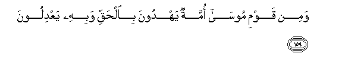

# وَمِنْ قَوْمِ مُوسَىٰ أُمَّةٌ يَهْدُونَ بِالْحَقِّ وَبِهِ يَعْدِلُونَ 

##Wamin qawmi moosa ommatun yahdoona bialhaqqi wabihi yaAAdiloona 

## 翻译(Translation)：

| Translator | 译文(Translation)                                            |
| :--------: | ------------------------------------------------------------ |
|    马坚    | 穆萨的宗族中，有一伙人，本著真理引导他人，因真理而主持公道。 |
|  YUSUFALI  | Of the people of Moses there is a section who guide and do justice in the light of truth. |
| PICKTHALL  | And of Moses' folk there is a community who lead with truth and establish justice therewith. |
|   SHAKIR   | And of Musa's people was a party who guided (people) with the truth, and thereby did they do justice. |

---

## 对位释义(Words Interpretation)：

| No   | العربية | 中文    | English | 曾用词 |
| ---- | ------: | ------- | ------- | ------ |
| 序号 |    阿文 | Chinese | 英文    | Used   |
| 7:159.1 | وَمِنْ    | 和从         | And from        | 见2:8.1   |
| 7:159.2 | قَوْمِ    | 我的宗族     | my people       | 见2:54.6  |
| 7:159.3 | مُوسَىٰ   | 穆萨         | Moses           | 见2:51.3  |
| 7:159.4 | أُمَّةٌ    | 一个民族     | a nation        | 见2:128.7 |
| 7:159.5 | يَهْدُونَ  | 他引导       | he guided       |           |
| 7:159.6 | بِالْحَقِّ  | 以真理       | with truth      | 见2:71.20 |
| 7:159.7 | وَبِهِ    | 和以它       | and with it     | 参2:22.13 |
| 7:159.8 | يَعْدِلُونَ | 他们主持公道 | they do justice | 异6:1.14  |

---