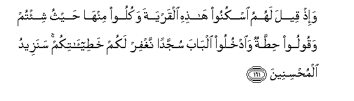

# وَإِذْ قِيلَ لَهُمُ اسْكُنُوا هَٰذِهِ الْقَرْيَةَ وَكُلُوا مِنْهَا حَيْثُ شِئْتُمْ وَقُولُوا حِطَّةٌ وَادْخُلُوا الْبَابَ سُجَّدًا نَغْفِرْ لَكُمْ خَطِيئَاتِكُمْ ۚ سَنَزِيدُ الْمُحْسِنِينَ 

##Wa-ith qeela lahumu oskunoo hathihi alqaryata wakuloo minha haythu shi/tum waqooloo hittatun waodkhuloo albaba sujjadan naghfir lakum khatee-atikum sanazeedu almuhsineena 

## 翻译(Translation)：

| Translator | 译文(Translation)                                            |
| :--------: | ------------------------------------------------------------ |
|    马坚    | 当时，（我）对他们说：你们可以居住在这个城市，而任意吃其中的食物，你们应当鞠躬而入城门，并且说：『释我重负』，我就饶恕你们的种种罪过，我要厚报善人。 |
|  YUSUFALI  | And remember it was said to them: "Dwell in this town and eat therein as ye wish, but say the word of humility and enter the gate in a posture of humility: We shall forgive you your faults; We shall increase (the portion of) those who do good." |
| PICKTHALL  | And when it was said unto them: Dwell in this township and eat therefrom whence ye will, and say "Repentance," and enter the gate prostrate; We shall forgive you your sins; We shall increase (reward) for the right-doers. |
|   SHAKIR   | And when it was said to them: Reside in this town and eat from it wherever you wish, and say, Put down from us our heavy burdens: and enter the gate making obeisance, We will forgive you your wrongs: We will give more to those who do good (to others). |

---

## 对位释义(Words Interpretation)：

| No   | العربية | 中文    | English | 曾用词 |
| ---- | ------: | ------- | ------- | ------ |
| 序号 |    阿文 | Chinese | 英文    | Used   |
| 7:161.1  | وَإِذْ      | 和当时         | and when          | 见2:30.1   |
| 7:161.2  | قِيلَ      | 告诉           | said              | 见2:11.2   |
| 7:161.3  | لَهُمُ      | 对他们         | for them          | 见2:11.3   |
| 7:161.4  | اسْكُنُوا   | 你们应居住     | Dwell             |            |
| 7:161.5  | هَٰذِهِ      | 这个           | this              | 见2:35.15  |
| 7:161.6  | الْقَرْيَةَ   | 城市           | the town          | 见2:58.5   |
| 7:161.7  | وَكُلُوا    | 和吃           | and eat           | 见2:187.31 |
| 7:161.8  | مِنْهَا     | 从它           | From it           | 见2:25.15  |
| 7:161.9  | حَيْثُ      | 地方           | Where             | 见2:35.11  |
| 7:161.10 | شِئْتُمْ     | 你们希望       | as you wish       | 见2:58.9   |
| 7:161.11 | وَقُولُوا   | 和你们说       | And you said      | 见2:58.14  |
| 7:161.12 | حِطَّةٌ      | 悔改，释我重负 | Repentance        | 见2:58.15  |
| 7:161.13 | وَادْخُلُوا  | 和进入         | and enter         | 见2:58.11  |
| 7:161.14 | الْبَابَ    | 城门           | the gate          | 见2:58.12  |
| 7:161.15 | سُجَّدًا     | 鞠躬           | prostrate         | 见2:58.13  |
| 7:161.16 | نَغْفِرْ     | 我们将赦宥     | We will forgive   | 见2:58.16  |
| 7:161.17 | لَكُمْ      | 为你们         | For you           | 见2:22.3   |
| 7:161.18 | خَطِيئَاتِكُمْ | 你们的众罪     | your sins         |            |
| 7:161.19 | سَنَزِيدُ    | 我们将增加     | We shall increase |            |
| 7:161.20 | الْمُحْسِنِينَ | 行善者         | The right-doers   | 见2:58.20  |

---