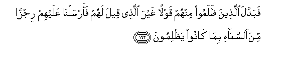

# فَبَدَّلَ الَّذِينَ ظَلَمُوا مِنْهُمْ قَوْلًا غَيْرَ الَّذِي قِيلَ لَهُمْ فَأَرْسَلْنَا عَلَيْهِمْ رِجْزًا مِنَ السَّمَاءِ بِمَا كَانُوا يَظْلِمُونَ 

##Fabaddala allatheena thalamoo minhum qawlan ghayra allathee qeela lahum faarsalna AAalayhim rijzan mina alssama-i bima kanoo yathlimoona 

## 翻译(Translation)：

| Translator | 译文(Translation)                                            |
| :--------: | ------------------------------------------------------------ |
|    马坚    | 但他们中不义者改变了他们所奉的嘱言，故我因他们的不义而降天灾于他们。 |
|  YUSUFALI  | But the transgressors among them changed the word from that which had been given them so we sent on them a plague from heaven. For that they repeatedly transgressed. |
| PICKTHALL  | But those of them who did wrong changed the word which had been told them for another saying, and We sent down upon them wrath from heaven for their wrongdoing. |
|   SHAKIR   | But those who were unjust among them changed it for a saying other than that which had been spoken to them; so We sent upon them a pestilence from heaven because they were unjust. |

---

## 对位释义(Words Interpretation)：

| No   | العربية | 中文    | English | 曾用词 |
| ---- | ------: | ------- | ------- | ------ |
| 序号 |    阿文 | Chinese | 英文    | Used   |
| 7:162.1  | فَبَدَّلَ    | 然而他改变               | But he changed   | 见2:59.1  |
| 7:162.2  | الَّذِينَ   | 谁，那些                 | those who        | 见2:6.2   |
| 7:162.3  | ظَلَمُوا   | 不义的人                 | unjust           | 见2:59.3  |
| 7:162.4  | مِنْهُمْ    | 从他们                   | from them        | 见2:75.8  |
| 7:162.5  | قَوْلًا    | 话语                     | The word         | 见2:59.4  |
| 7:162.6  | غَيْرَ     | 非，除了，除开，不是，但 | non, but         | 见1:7.5   |
| 7:162.7  | الَّذِي    | 谁                       | who              | 见2:17.3  |
| 7:162.8  | قِيلَ     | 告诉                     | said             | 见2:11.2  |
| 7:162.9  | لَهُمْ     | 对他们                   | for them         | 见2:11.3  |
| 7:162.10 | فَأَرْسَلْنَا | 因此我派遣               | so We sent       | 见7:133.1 |
| 7:162.11 | عَلَيْهِمْ   | 在他们                   | on they          | 见1:7.4   |
| 7:162.12 | رِجْزًا    | 惩罚                     | a plague         | 见2:59.13 |
| 7:162.13 | مِنَ      | 从                       | from             | 见2:19.3  |
| 7:162.14 | السَّمَاءِ  | 天空                     | The sky, heaven  | 见2:19.4  |
| 7:162.15 | بِمَا     | 在什么                   | in what          | 见2:4.3   |
| 7:162.16 | كَانُوا   | 他们是                   | they were        | 见2:10:11 |
| 7:162.17 | يَظْلِمُونَ  | 他们欺骗                 | They are wronged | 见2:57.18 |

---