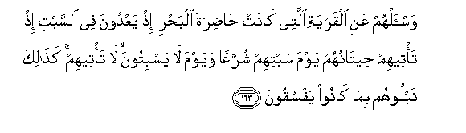

# وَاسْأَلْهُمْ عَنِ الْقَرْيَةِ الَّتِي كَانَتْ حَاضِرَةَ الْبَحْرِ إِذْ يَعْدُونَ فِي السَّبْتِ إِذْ تَأْتِيهِمْ حِيتَانُهُمْ يَوْمَ سَبْتِهِمْ شُرَّعًا وَيَوْمَ لَا يَسْبِتُونَ ۙ لَا تَأْتِيهِمْ ۚ كَذَٰلِكَ نَبْلُوهُمْ بِمَا كَانُوا يَفْسُقُونَ 

##Wais-alhum AAani alqaryati allatee kanat hadirata albahri ith yaAAdoona fee alssabti ith ta/teehim heetanuhum yawma sabtihim shurraAAan wayawma la yasbitoona la ta/teehim kathalika nabloohum bima kanoo yafsuqoona 

## 翻译(Translation)：

| Translator | 译文(Translation)                                            |
| :--------: | ------------------------------------------------------------ |
|    马坚    | 你向他们询问那个滨海城市的情况吧。当时他们在安息日违法乱纪。当时，每逢他们守安息日的时候，鱼儿就浮游到他们面前来；每逢他们不守安息日的时候，鱼儿就不到他们的面前来。由于他们不义的行为，我才这样考验他们。 |
|  YUSUFALI  | Ask them concerning the town standing close by the sea. Behold! they transgressed in the matter of the Sabbath. For on the day of their Sabbath their fish did come to them, openly holding up their heads, but on the day they had no Sabbath, they came not: thus did We make a trial of them, for they were given to transgression. |
| PICKTHALL  | Ask them (O Muhammad) of the township that was by the sea, how they did break the Sabbath, how their big fish came unto them visibly upon their Sabbath day and on a day when they did not keep Sabbath came they not unto them. Thus did We try them for that they were evil-livers. |
|   SHAKIR   | And ask them about the town which stood by the sea; when they exceeded the limits of the Sabbath, when their fish came to them on the day of their Sabbath, appearing on the surface of the water, and on the day on which they did not keep the Sabbath they did not come to them; thus did We try them because they transgressed. |

---

## 对位释义(Words Interpretation)：

| No   | العربية | 中文    | English | 曾用词 |
| ---- | ------: | ------- | ------- | ------ |
| 序号 |    阿文 | Chinese | 英文    | Used   |
| 7:163.1  | وَاسْأَلْهُمْ | 和你询问他们     | and ask them      |            |
| 7:163.2  | عَنِ      | 关于             | about             | 见2:189.2  |
| 7:163.3  | الْقَرْيَةِ  | 城镇             | town              | 见4:75.19  |
| 7:163.4  | الَّتِي    | 哪               | Which             | 见2:24.8   |
| 7:163.5  | كَانَتْ    | 她是             | she was           | 见2:94.3   |
| 7:163.6  | حَاضِرَةَ   | 附近             | close by          |            |
| 7:163.7  | الْبَحْرِ   | 大海             | the sea           | 见2:164.13 |
| 7:163.8  | إِذْ      | 当时             | when              | 见2:131.1  |
| 7:163.9  | يَعْدُونَ   | 他们违法乱纪     | they transgressed |            |
| 7:163.10 | فِي      | 在               | in                | 见2:10.1   |
| 7:163.11 | السَّبْتِ   | 星期六（安息日） | the Sabbath       | 见2:65.7   |
| 7:163.12 | إِذْ      | 当时             | when              | 见2:131.1  |
| 7:163.13 | تَأْتِيهِمْ  | 他来至他们       | he come to them   | 见6:4.2    |
| 7:163.14 | حِيتَانُهُمْ | 他们的鱼         | their fish        |            |
| 7:163.15 | يَوْمَ     | 日，日子，时候的 | day               | 见1:4.2    |
| 7:163.16 | سَبْتِهِمْ   | 他们的安息日     | their Sabbath     |            |
| 7:163.17 | شُرَّعًا    | 浮现             | appearing         |            |
| 7:163.18 | وَيَوْمَ    | 和日子           | and day           | 见2:85.39  |
| 7:163.19 | لَا      | 不，不是，没有   | no                | 见2:2.3    |
| 7:163.20 | يَسْبِتُونَ  | 他们安息         | they keep Sabbath |            |
| 7:163.21 | لَا      | 不，不是，没有   | no                | 见2:2.3    |
| 7:163.22 | تَأْتِيهِمْ  | 他来至他们       | he come to them   | 见6:4.2    |
| 7:163.23 | كَذَٰلِكَ    | 像如此           | Thus              | 见2:73.4   |
| 7:163.24 | نَبْلُوهُمْ  | 我们考验他们     | We try them       |            |
| 7:163.25 | بِمَا     | 在什么           | in what           | 见2:4.3    |
| 7:163.26 | كَانُوا   | 他们是           | they were         | 见2:10:11  |
| 7:163.27 | يَفْسُقُونَ  | 犯罪             | transgressed      | 见2:59.18  |

---