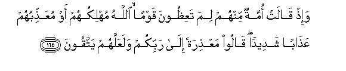

# وَإِذْ قَالَتْ أُمَّةٌ مِنْهُمْ لِمَ تَعِظُونَ قَوْمًا ۙ اللَّهُ مُهْلِكُهُمْ أَوْ مُعَذِّبُهُمْ عَذَابًا شَدِيدًا ۖ قَالُوا مَعْذِرَةً إِلَىٰ رَبِّكُمْ وَلَعَلَّهُمْ يَتَّقُونَ 

##Wa-ith qalat ommatun minhum lima taAAithoona qawman Allahu muhlikuhum aw muAAaththibuhum AAathaban shadeedan qaloo maAAthiratan ila rabbikum walaAAallahum yattaqoona 

## 翻译(Translation)：

| Translator | 译文(Translation)                                            |
| :--------: | ------------------------------------------------------------ |
|    马坚    | 当时，他们中有一伙人说：真主要加以毁灭，或加以严惩的民众，你们何必劝戒他们呢？他们说：因为求得你们主的原谅，而且希望他们能敬畏。 |
|  YUSUFALI  | When some of them said: "Why do ye preach to a people whom Allah will destroy or visit with a terrible punishment?"- said the preachers:" To discharge our duty to your Lord, and perchance they may fear Him." |
| PICKTHALL  | And when a community among them said: Why preach ye to a folk whom Allah is about to destroy or punish with an awful doom, they said: In order to be free from guilt before your Lord, and that haply they may ward off (evil). |
|   SHAKIR   | And when a party of them said: Why do you admonish a with a severe chastisement? They said: To be free from blame before your Lord, and that haply they may guard (against evil). |

---

## 对位释义(Words Interpretation)：

| No   | العربية | 中文    | English | 曾用词 |
| ---- | ------: | ------- | ------- | ------ |
| 序号 |    阿文 | Chinese | 英文    | Used   |
| 7:164.1  | وَإِذْ    | 和当时     | and when               | 见2:30.1   |
| 7:164.2  | قَالَتْ   | 她说       | she said               | 见3:36.3   |
| 7:164.3  | أُمَّةٌ    | 一个民族   | a nation               | 见2:128.7  |
| 7:164.4  | مِنْهُمْ   | 从他们     | from them              | 见2:75.8   |
| 7:164.5  | لِمَ     | 为什么     | why                    | 见3:65.4   |
| 7:164.6  | تَعِظُونَ  | 你们劝诫   | you preach             |            |
| 7:164.7  | قَوْمًا   | 民众       | a people               | 见3:86.4   |
| 7:164.8  | اللَّهُ   | 安拉，真主 | Allah                  | 见2:7.2    |
| 7:164.9  | مُهْلِكُهُمْ | 毁灭他们   | destroy them           |            |
| 7:164.10 | أَوْ     | 或         | or                     | 见2:19.1   |
| 7:164.11 | مُعَذِّبُهُمْ | 惩罚他们   | punish them            |            |
| 7:164.12 | عَذَابًا  | 刑罚       | chastisement           | 见3:56.5   |
| 7:164.13 | شَدِيدًا  | 严厉的     | severe                 | 见3:56.6   |
| 7:164.14 | قَالُوا  | 他们说，   | They said              | 见2:11.8   |
| 7:164.15 | مَعْذِرَةً  | 原谅       | be free from blame     |            |
| 7:164.16 | إِلَىٰ    | 至         | to                     | 见2:14.9   |
| 7:164.17 | رَبِّكُمْ   | 你们的主   | Your Lord              | 见2:21.5   |
| 7:164.18 | وَلَعَلَّهُمْ | 以便他们   | and in order that they | 参2:186.16 |
| 7:164.19 | يَتَّقُونَ  | 他们敬畏   | learn self-restraint   | 见2:187.65 |

---