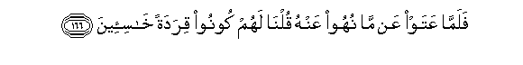

# فَلَمَّا عَتَوْا عَنْ مَا نُهُوا عَنْهُ قُلْنَا لَهُمْ كُونُوا قِرَدَةً خَاسِئِينَ 

##Falamma AAataw AAan ma nuhoo AAanhu qulna lahum koonoo qiradatan khasi-eena 

## 翻译(Translation)：

| Translator | 译文(Translation)                                            |
| :--------: | ------------------------------------------------------------ |
|    马坚    | 当他们妄自尊大，不肯遵守戒律的时候，我对他们说：你们变成卑贱的猿猴吧！ |
|  YUSUFALI  | When in their insolence they transgressed (all) prohibitions, We said to them: "Be ye apes, despised and rejected." |
| PICKTHALL  | So when they took pride in that which they had been forbidden, We said unto them: Be ye apes despised and loathed! |
|   SHAKIR   | Therefore when they revoltingly persisted in what they had been forbidden, We said to them: Be (as) apes, despised and hated. |

---

## 对位释义(Words Interpretation)：

| No   | العربية | 中文    | English | 曾用词 |
| ---- | ------: | ------- | ------- | ------ |
| 序号 |    阿文 | Chinese | 英文    | Used   |
| 7:166.1  | فَلَمَّا   | 但是当       | but when            | 见2:17.6  |
| 7:166.2  | عَتَوْا   | 他们妄自尊大 | they took pride     |           |
| 7:166.3  | عَنْ     | 从           | on                  | 见2:48.6  |
| 7:166.4  | مَا     | 什么         | what/ that which    | 见2:17.8  |
| 7:166.5  | نُهُوا   | 他们被禁止   | they were forbidden | 见4:161.4 |
| 7:166.6  | عَنْهُ    | 从它         | on it               | 见4:31.6  |
| 7:166.7  | قُلْنَا   | 我们说       | We said             | 见2:34.2  |
| 7:166.8  | لَهُمْ    | 对他们       | for them            | 见2:11.3  |
| 7:166.9  | كُونُوا  | 你们是       | Be you              | 见2:65.10 |
| 7:166.10 | قِرَدَةً   | 猿猴         | apes                | 见2:65.11 |
| 7:166.11 | خَاسِئِينَ | 卑贱的       | despised and hated  | 见2:65.12 |

---