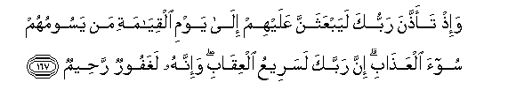

# وَإِذْ تَأَذَّنَ رَبُّكَ لَيَبْعَثَنَّ عَلَيْهِمْ إِلَىٰ يَوْمِ الْقِيَامَةِ مَنْ يَسُومُهُمْ سُوءَ الْعَذَابِ ۗ إِنَّ رَبَّكَ لَسَرِيعُ الْعِقَابِ ۖ وَإِنَّهُ لَغَفُورٌ رَحِيمٌ 

##Wa-ith taaththana rabbuka layabAAathanna AAalayhim ila yawmi alqiyamati man yasoomuhum soo-a alAAathabi inna rabbaka lasareeAAu alAAiqabi wa-innahu laghafoorun raheemun 

## 翻译(Translation)：

| Translator | 译文(Translation)                                            |
| :--------: | ------------------------------------------------------------ |
|    马坚    | 当时，你的主宣布他一定派人来使他们继续遭受酷刑，直到复活日。你的主的惩罚确是神速的。他确是至赦的，确是至慈的。 |
|  YUSUFALI  | Behold! thy Lord did declare that He would send against them, to the Day of Judgment, those who would afflict them with grievous penalty. Thy Lord is quick in retribution, but He is also Oft-forgiving, Most Merciful. |
| PICKTHALL  | And (remember) when thy Lord proclaimed that He would raise against them till the Day of Resurrection those who would lay on them a cruel torment. Lo! verily thy Lord is swift in prosecution and lo! verily He is Forgiving, Merciful. |
|   SHAKIR   | And when your Lord announced that He would certainly send against them to the day of resurrection those who would subject them to severe torment; most surely your Lord is quick to requite (evil) and most surely He is Forgiving, Merciful. |

---

## 对位释义(Words Interpretation)：

| No   | العربية | 中文    | English | 曾用词 |
| ---- | ------: | ------- | ------- | ------ |
| 序号 |    阿文 | Chinese | 英文    | Used   |
| 7:167.1  | وَإِذْ     | 和当时           | and when                | 见2:30.1   |
| 7:167.2  | تَأَذَّنَ    | 他宣布           | he proclaimed           |            |
| 7:167.3  | رَبُّكَ     | 您的主           | Your Lord               | 见2:30.3   |
| 7:167.4  | لَيَبْعَثَنَّ  | 他必定派遣       | He would certainly send |            |
| 7:167.5  | عَلَيْهِمْ   | 在他们           | on they                 | 见1:7.4    |
| 7:167.6  | إِلَىٰ     | 至               | to                      | 见2:14.9   |
| 7:167.7  | يَوْمِ     | 日，日子，时候的 | day                     | 见1:4.2    |
| 7:167.8  | الْقِيَامَةِ | 复活的           | Resurrection            | 见2:85.40  |
| 7:167.9  | مَنْ      | 谁               | who                     | 见2:8.3    |
| 7:167.10 | يَسُومُهُمْ  | 他遭受他们       | he would subject them   |            |
| 7:167.11 | سُوءَ     | 恐怖的           | dreadful                | 见2:49.7   |
| 7:167.12 | الْعَذَابِ  | 刑罚             | Torment                 | 见2:49.8   |
| 7:167.13 | إِنَّ      | 的确             | surely                  | 见2:6.1    |
| 7:167.14 | رَبَّكَ     | 您的主           | Your Lord               | 见2:30.3   |
| 7:167.15 | لَسَرِيعُ   | 必定神速         | surely swift in         | 参2:202.7  |
| 7:167.16 | الْعِقَابِ  | 刑罚             | punishment              | 见2:196.73 |
| 7:167.17 | وَإِنَّهُ    | 和确实他         | and he is               | 见2:130.14 |
| 7:167.18 | لَغَفُورٌ   | 必定至赦的       | surely forgiving        | 见6:165.20 |
| 7:167.19 | رَحِيمٌ    | 至慈的           | Merciful                | 见2:143.45 |

---