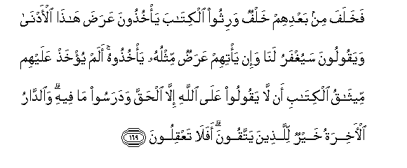

# فَخَلَفَ مِنْ بَعْدِهِمْ خَلْفٌ وَرِثُوا الْكِتَابَ يَأْخُذُونَ عَرَضَ هَٰذَا الْأَدْنَىٰ وَيَقُولُونَ سَيُغْفَرُ لَنَا وَإِنْ يَأْتِهِمْ عَرَضٌ مِثْلُهُ يَأْخُذُوهُ ۚ أَلَمْ يُؤْخَذْ عَلَيْهِمْ مِيثَاقُ الْكِتَابِ أَنْ لَا يَقُولُوا عَلَى اللَّهِ إِلَّا الْحَقَّ وَدَرَسُوا مَا فِيهِ ۗ وَالدَّارُ الْآخِرَةُ خَيْرٌ لِلَّذِينَ يَتَّقُونَ ۗ أَفَلَا تَعْقِلُونَ 

##Fakhalafa min baAAdihim khalfun warithoo alkitaba ya/khuthoona AAarada hatha al-adna wayaqooloona sayughfaru lana wa-in ya/tihim AAaradun mithluhu ya/khuthoohu alam yu/khath AAalayhim meethaqu alkitabi an layaqooloo AAala Allahi illa alhaqqa wadarasoo ma feehi waalddaru al-akhiratu khayrun lillatheena yattaqoona afalataAAqiloona 

## 翻译(Translation)：

| Translator | 译文(Translation)                                            |
| :--------: | ------------------------------------------------------------ |
|    马坚    | 在他们死亡之后，有不肖的后裔代替他们而继承了天经，那些后裔攫取今世浮利，还说：我们将蒙饶恕。如果有同样的浮利来到他们的身边，他们还将攫取。难道天经中没有明文教导他们只能以真理归于真主吗？难道他们没有诵习过那些明文吗？后世的安宅，对于敬要者是更优美的。难道你们不理解吗？ |
|  YUSUFALI  | After them succeeded an (evil) generation: They inherited the Book, but they chose (for themselves) the vanities of this world, saying (for excuse): "(Everything) will be forgiven us." (Even so), if similar vanities came their way, they would (again) seize them. Was not the covenant of the Book taken from them, that they would not ascribe to Allah anything but the truth? and they study what is in the Book. But best for the righteous is the home in the Hereafter. Will ye not understand? |
| PICKTHALL  | And a generation hath succeeded them who inherited the scriptures. They grasp the goods of this low life (as the price of evil-doing) and say: It will be forgiven us. And if there came to them (again) the offer of the like, they would accept it (and would sin again). Hath not the covenant of the Scripture been taken on their behalf that they should not speak aught concerning Allah save the truth? And they have studied that which is therein. And the abode of the Hereafter is better, for those who ward off (evil). Have ye then no sense? |
|   SHAKIR   | Then there came after them an evil posterity who inherited the Book, taking only the frail good of this low life and saying: It will be forgiven us. And if the like good came to them, they would take it (too). Was not a promise taken from them in the Book that they would not speak anything about Allah but the truth, and they have read what is in it; and the abode of the hereafter is better for those who guard (against evil). Do you not then understand? |

---

## 对位释义(Words Interpretation)：

| No   | العربية | 中文    | English | 曾用词 |
| ---- | ------: | ------- | ------- | ------ |
| 序号 |    阿文 | Chinese | 英文    | Used   |
| 7:169.1  | فَخَلَفَ    | 因此他们继承   | then they succeeded  |            |
| 7:169.2  | مِنْ      | 从             | from                 | 见2:4.8    |
| 7:169.3  | بَعْدِهِمْ   | 他们之后       | after them           | 见2:253.29 |
| 7:169.4  | خَلْفٌ     | 众继承者       | successor            |            |
| 7:169.5  | وَرِثُوا   | 他们继承       | they inherited       |            |
| 7:169.6  | الْكِتَابَ  | 这部经，这本书 | the book             | 见2:2.2    |
| 7:169.7  | يَأْخُذُونَ  | 他们攫取       | they grasp           |            |
| 7:169.8  | عَرَضَ     | 利益           | goods                | 见4:94.20  |
| 7:169.9  | هَٰذَا     | 这个，此       | This                 | 见2:25.20  |
| 7:169.10 | الْأَدْنَىٰ  | 今世           | world                |            |
| 7:169.11 | وَيَقُولُونَ | 和他们说       | and they tell        | 见3:75.31  |
| 7:169.12 | سَيُغْفَرُ   | 它将被饶恕     | It will be forgiven  |            |
| 7:169.13 | لَنَا     | 为我们         | for us               | 见2:32.5   |
| 7:169.14 | وَإِنْ     | 和如果         | and if               | 见2:23.1   |
| 7:169.15 | يَأْتِهِمْ   | 它来至他们     | it came to them      |            |
| 7:169.16 | عَرَضٌ     | 利益           | goods                | 参4:94.20  |
| 7:169.17 | مِثْلُهُ    | 相似它         | like it              | 见3:140.8  |
| 7:169.18 | يَأْخُذُوهُ  | 他们攫取它     | they would take it   |            |
| 7:169.19 | أَلَمْ     | 难道不         | did not              | 见2:33.10  |
| 7:169.20 | يُؤْخَذْ    | 它被接受       | it will be accepted  | 见6:70.30  |
| 7:169.21 | عَلَيْهِمْ   | 在他们         | on they              | 见1:7.4    |
| 7:169.22 | مِيثَاقُ   | 明文           | the covenant         |            |
| 7:169.23 | الْكِتَابِ  | 这部经的       | of the Book          | 见2:85.25  |
| 7:169.24 | أَنْ      | 该             | that                 | 见2:26.5   |
| 7:169.25 | لَا      | 不，不是，没有 | no                   | 见2:2.3    |
| 7:169.26 | يَقُولُوا  | 他们说         | they say             | 见4:78.13  |
| 7:169.27 | عَلَى     | 至             | On                   | 见2:5.2    |
| 7:169.28 | اللَّهِ    | 真主的         | of Allah             | 见2:23.17  |
| 7:169.29 | إِلَّا     | 除了           | Except               | 见2:9.7    |
| 7:169.30 | الْحَقَّ    | 正确的，真理   | Right, truth         | 见2:26.17  |
| 7:169.31 | وَدَرَسُوا  | 和他们研习     | and they study       |            |
| 7:169.32 | مَا      | 什么           | what/ that which     | 见2:17.8   |
| 7:169.33 | فِيهِ     | 它，其中       | in it                | 见2:2.5    |
| 7:169.34 | وَالدَّارُ  | 和住宅         | and abode            | 参2:94.5   |
| 7:169.35 | الْآخِرَةُ  | 后世           | the Hereafter        | 见2:94.6   |
| 7:169.36 | خَيْرٌ     | 较好的         | be better            | 见2:54.18  |
| 7:169.37 | لِلَّذِينَ   | 对那些人       | to those who         | 见2:79.2   |
| 7:169.38 | يَتَّقُونَ   | 他们敬畏       | learn self-restraint | 见2:187.65 |
| 7:169.39 | أَفَلَا    | 岂不           | will not             | 见2:44.9   |
| 7:169.40 | تَعْقِلُونَ  | 你们了解       | you understand       | 见2:44.10  |

---