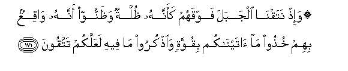

# ۞ وَإِذْ نَتَقْنَا الْجَبَلَ فَوْقَهُمْ كَأَنَّهُ ظُلَّةٌ وَظَنُّوا أَنَّهُ وَاقِعٌ بِهِمْ خُذُوا مَا آتَيْنَاكُمْ بِقُوَّةٍ وَاذْكُرُوا مَا فِيهِ لَعَلَّكُمْ تَتَّقُونَ 

##Wa-ith nataqna aljabala fawqahum kaannahu thullatun wathannoo annahu waqiAAun bihim khuthoo maataynakum biquwwatin waothkuroo ma feehi laAAallakum tattaqoona 

## 翻译(Translation)：

| Translator | 译文(Translation)                                            |
| :--------: | ------------------------------------------------------------ |
|    马坚    | 当时我使那座山在他们的上面震动，好像伞盖一样，他们猜想那座山要落在他们的头上。我说：你们当坚持我赐予你们的经典，并当牢记其中的教训，以便你们敬畏。 |
|  YUSUFALI  | When We shook the Mount over them, as if it had been a canopy, and they thought it was going to fall on them (We said): "Hold firmly to what We have given you, and bring (ever) to remembrance what is therein; perchance ye may fear Allah." |
| PICKTHALL  | And when We shook the Mount above them as it were a covering, and they supposed that it was going to fall upon them (and We said): Hold fast that which We have given you, and remember that which is therein, that ye may ward off (evil). |
|   SHAKIR   | And when We shook the mountain over them as if it were a covering overhead, and they thought that it was going to fall down upon them: Take hold of what We have given you with firmness, and be mindful of what is in it, so that you may guard (against evil). |

---

## 对位释义(Words Interpretation)：

| No   | العربية | 中文    | English | 曾用词 |
| ---- | ------: | ------- | ------- | ------ |
| 序号 |    阿文 | Chinese | 英文    | Used   |
| 7:171.1  | وَإِذْ     | 和当时       | and when           | 见2:30.1   |
| 7:171.2  | نَتَقْنَا   | 我们摇动     | We shook           |            |
| 7:171.3  | الْجَبَلَ   | 山           | the mountain       |            |
| 7:171.4  | فَوْقَهُمْ   | 他们之上     | above them         | 见2:212.12 |
| 7:171.5  | كَأَنَّهُ    | 像那个它     | as if it           |            |
| 7:171.6  | ظُلَّةٌ     | 一个罩盖     | a covering         |            |
| 7:171.7  | وَظَنُّوا   | 和他们想     | and they thought   |            |
| 7:171.8  | أَنَّهُ     | 他是         | that he is         | 见2:26.16  |
| 7:171.9  | وَاقِعٌ    | 落下         | going to fall down |            |
| 7:171.10 | بِهِمْ     | 在他们       | on them            | 见2:15.3   |
| 7:171.11 | خُذُوا    | 你们守       | Take hold of       | 见2:63.7   |
| 7:171.12 | مَا      | 什么         | what/ that which   | 见2:17.8   |
| 7:171.13 | آتَيْنَاكُمْ | 我们赐给你们 | We have given you  | 见2:63.9   |
| 7:171.14 | بِقُوَّةٍ    | 以坚定       | with firmness      | 见2:63.10  |
| 7:171.15 | وَاذْكُرُوا | 和记得       | and remember       | 见2:63.11  |
| 7:171.16 | مَا      | 什么         | what/ that which   | 见2:17.8   |
| 7:171.17 | فِيهِ     | 它，其中     | in it              | 见2:2.5    |
| 7:171.18 | لَعَلَّكُمْ   | 以便你们     | you may            | 见2:21.11  |
| 7:171.19 | تَتَّقُونَ   | 敬畏         | Cautious           | 见2:21.12  |

---