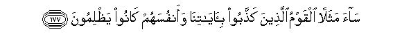

# سَاءَ مَثَلًا الْقَوْمُ الَّذِينَ كَذَّبُوا بِآيَاتِنَا وَأَنْفُسَهُمْ كَانُوا يَظْلِمُونَ 

##Saa mathalan alqawmu allatheena kaththaboo bi-ayatina waanfusahum kanoo yathlimoona 

## 翻译(Translation)：

| Translator | 译文(Translation)                                            |
| :--------: | ------------------------------------------------------------ |
|    马坚    | 否认我的迹象，而且自欺的民众，其譬喻真恶劣！                 |
|  YUSUFALI  | Evil as an example are people who reject Our signs and wrong their own souls. |
| PICKTHALL  | Evil as an example are the folk who denied Our revelations, and were wont to wrong themselves. |
|   SHAKIR   | Evil is the likeness of the people who reject Our communications and are unjust to their own souls. |

---

## 对位释义(Words Interpretation)：

| No   | العربية | 中文    | English | 曾用词 |
| ---- | ------: | ------- | ------- | ------ |
| 序号 |    阿文 | Chinese | 英文    | Used   |
| 7:177.1 | سَاءَ     | 它恶劣       | evil is that     | 见5:66.22 |
| 7:177.2 | مَثَلًا    | 例如，比喻   | For example      | 见2:26.7  |
| 7:177.3 | الْقَوْمُ   | 民众         | people           | 见6:47.13 |
| 7:177.4 | الَّذِينَ   | 谁，那些     | those who        | 见2:6.2   |
| 7:177.5 | كَذَّبُوا   | 他们否认     | they denied      | 见3:11.7  |
| 7:177.6 | بِآيَاتِنَا | 在我们的迹象 | in Our signs     | 见2:39.4  |
| 7:177.7 | وَأَنْفُسَهُمْ | 和他们自己   | and themselves   | 参2:9.8   |
| 7:177.8 | كَانُوا   | 他们是       | they were        | 见2:10:11 |
| 7:177.9 | يَظْلِمُونَ  | 他们欺骗     | They are wronged | 见2:57.18 |

---