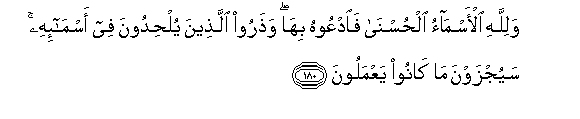

# وَلِلَّهِ الْأَسْمَاءُ الْحُسْنَىٰ فَادْعُوهُ بِهَا ۖ وَذَرُوا الَّذِينَ يُلْحِدُونَ فِي أَسْمَائِهِ ۚ سَيُجْزَوْنَ مَا كَانُوا يَعْمَلُونَ 

##Walillahi al-asmao alhusna faodAAoohu biha watharoo allatheena yulhidoona fee asma-ihi sayujzawna makanoo yaAAmaloona 

## 翻译(Translation)：

| Translator | 译文(Translation)                                            |
| :--------: | ------------------------------------------------------------ |
|    马坚    | 真主有许多极美的名号，故你们要用那些名号呼吁他。妄用真主的名号者， 你们可以置之不理，他们将受自己行为的报酬。 |
|  YUSUFALI  | The most beautiful names belong to Allah: so call on him by them; but shun such men as use profanity in his names: for what they do, they will soon be requited. |
| PICKTHALL  | Allah's are the fairest names. Invoke Him by them. And leave the company of those who blaspheme His names. They will be requited what they do. |
|   SHAKIR   | And Allah's are the best names, therefore call on Him thereby, and leave alone those who violate the sanctity of His names; they shall be recompensed for what they did. |

---

## 对位释义(Words Interpretation)：

| No   | العربية | 中文    | English | 曾用词 |
| ---- | ------: | ------- | ------- | ------ |
| 序号 |    阿文 | Chinese | 英文    | Used   |
| 7:180.1  | وَلِلَّهِ    | 和归真主         | and to Allah              | 见2:115.1 |
| 7:180.2  | الْأَسْمَاءُ | 众名字           | names                     |           |
| 7:180.3  | الْحُسْنَىٰ  | 好的             | good                      | 见4:95.26 |
| 7:180.4  | فَادْعُوهُ  | 因此你们应称呼他 | so call on him            |           |
| 7:180.5  | بِهَا     | 在他们           | in them                   | 见2:99.8  |
| 7:180.6  | وَذَرُوا   | 和放弃           | and give up               | 见2:278.7 |
| 7:180.7  | الَّذِينَ   | 谁，那些         | those who                 | 见2:6.2   |
| 7:180.8  | يُلْحِدُونَ  | 他们妄用         | they blaspheme            |           |
| 7:180.9  | فِي      | 在               | in                        | 见2:10.1  |
| 7:180.10 | أَسْمَائِهِ  | 他的众名字       | His names                 |           |
| 7:180.11 | سَيُجْزَوْنَ  | 他们将被报应     | they shall be recompensed | 见6:120.9 |
| 7:180.12 | مَا      | 什么             | what/ that which          | 见2:17.8  |
| 7:180.13 | كَانُوا   | 他们是           | they were                 | 见2:10:11 |
| 7:180.14 | يَعْمَلُونَ  | 他们的行为       | they do                   | 见2:96.25 |

---