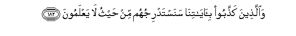

# وَالَّذِينَ كَذَّبُوا بِآيَاتِنَا سَنَسْتَدْرِجُهُمْ مِنْ حَيْثُ لَا يَعْلَمُونَ 

##Waallatheena kaththaboo bi-ayatina sanastadrijuhum min haythu la yaAAlamoona 

## 翻译(Translation)：

| Translator | 译文(Translation)                                            |
| :--------: | ------------------------------------------------------------ |
|    马坚    | 否认我的迹象者，我要使他们不知不觉地渐趋于毁灭。             |
|  YUSUFALI  | Those who reject Our signs, We shall gradually visit with punishment, in ways they perceive not; |
| PICKTHALL  | And those who deny Our revelations - step by step We lead them on from whence they know not. |
|   SHAKIR   | And (as to) those who reject Our communications, We draw them near (to destruction) by degrees from whence they know not. |

---

## 对位释义(Words Interpretation)：

| No   | العربية | 中文    | English | 曾用词 |
| ---- | ------: | ------- | ------- | ------ |
| 序号 |    阿文 | Chinese | 英文    | Used   |
| 7:182.1 | وَالَّذِينَ    | 和那些             | and those who     | 见2:21.8  |
| 7:182.2 | كَذَّبُوا     | 他们否认           | they denied       | 见3:11.7  |
| 7:182.3 | بِآيَاتِنَا   | 在我们的迹象       | in Our signs      | 见2:39.4  |
| 7:182.4 | سَنَسْتَدْرِجُهُمْ | 我们讲逐渐采取他们 | We will draw them |           |
| 7:182.5 | مِنْ        | 从                 | from              | 见2:4.8   |
| 7:182.6 | حَيْثُ       | 地方               | Where             | 见2:35.11 |
| 7:182.7 | لَا        | 不，不是，没有     | no                | 见2:2.3   |
| 7:182.8 | يَعْلَمُونَ    | 知道               | Know              | 见2:13.19 |

---