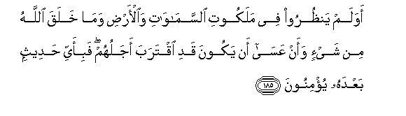

# أَوَلَمْ يَنْظُرُوا فِي مَلَكُوتِ السَّمَاوَاتِ وَالْأَرْضِ وَمَا خَلَقَ اللَّهُ مِنْ شَيْءٍ وَأَنْ عَسَىٰ أَنْ يَكُونَ قَدِ اقْتَرَبَ أَجَلُهُمْ ۖ فَبِأَيِّ حَدِيثٍ بَعْدَهُ يُؤْمِنُونَ 

##Awalam yanthuroo fee malakooti alssamawati waal-ardi wama khalaqa Allahu min shay-in waan AAasa an yakoona qadi iqtaraba ajaluhum fabi-ayyi hadeethin baAAdahu yu/minoona 

## 翻译(Translation)：

| Translator | 译文(Translation)                                            |
| :--------: | ------------------------------------------------------------ |
|    马坚    | 难道他们没有观察天地的主权和真主创造的万物吗？难道他们没有想到他们的寿限或许已临近了吗？此外，他们将信仰什么言辞呢？ |
|  YUSUFALI  | Do they see nothing in the government of the heavens and the earth and all that Allah hath created? (Do they not see) that it may well be that their terms is nigh drawing to an end? In what message after this will they then believe? |
| PICKTHALL  | Have they not considered the dominion of the heavens and the earth, and what things Allah hath created, and that it may be that their own term draweth nigh? In what fact after this will they believe? |
|   SHAKIR   | Do they not consider the kingdom of the heavens and the earth and whatever things Allah has created, and that may be their doom shall have drawn nigh; what announcement would they then believe in after this? |

---

## 对位释义(Words Interpretation)：

| No   | العربية | 中文    | English | 曾用词 |
| ---- | ------: | ------- | ------- | ------ |
| 序号 |    阿文 | Chinese | 英文    | Used   |
| 7:185.1  | أَوَلَمْ     | 和不吗？   | and do not         | 见2:260.10 |
| 7:185.2  | يَنْظُرُوا   | 他们观察   | they consider      |            |
| 7:185.3  | فِي       | 在         | in                 | 见2:10.1   |
| 7:185.4  | مَلَكُوتِ    | 主权       | the kingdom        |            |
| 7:185.5  | السَّمَاوَاتِ | 诸天的     | of the heavens     | 见2:33.16  |
| 7:185.6  | وَالْأَرْضِ   | 和土地     | and earth          | 见2:33.17  |
| 7:185.7  | وَمَا      | 和什么     | and that           | 见2:4.6    |
| 7:185.8  | خَلَقَ      | 创造       | created            | 见2:29.3   |
| 7:185.9  | اللَّهُ     | 安拉，真主 | Allah              | 见2:7.2    |
| 7:185.10 | مِنْ       | 从         | from               | 见2:4.8    |
| 7:185.11 | شَيْءٍ      | 事物       | Thing              | 见2:20.24  |
| 7:185.12 | وَأَنْ      | 和那个     | and that           | 见2:169.5  |
| 7:185.13 | عَسَىٰ      | 他或许     | It may be          | 见7:129.12 |
| 7:185.14 | أَنْ       | 该         | that               | 见2:26.5   |
| 7:185.15 | يَكُونَ     | 他是       | he is              | 见2:150.16 |
| 7:185.16 | قَدِ       | 当然       | may                | 见6:128.7  |
| 7:185.17 | اقْتَرَبَ    | 它临近     | it have drawn nigh |            |
| 7:185.18 | أَجَلُهُمْ    | 他们的定期 | their term         | 见7:34.6   |
| 7:185.19 | فَبِأَيِّ     | 然后在什么 | then In what       |            |
| 7:185.20 | حَدِيثٍ     | 一个谈话   | discourse          | 见4:140.21 |
| 7:185.21 | بَعْدَهُ     | 他之后     | after he           | 参2:27.6   |
| 7:185.22 | يُؤْمِنُونَ   | 他们确信   | they believe       | 见2:3.2    |

---