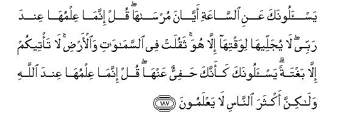

# يَسْأَلُونَكَ عَنِ السَّاعَةِ أَيَّانَ مُرْسَاهَا ۖ قُلْ إِنَّمَا عِلْمُهَا عِنْدَ رَبِّي ۖ لَا يُجَلِّيهَا لِوَقْتِهَا إِلَّا هُوَ ۚ ثَقُلَتْ فِي السَّمَاوَاتِ وَالْأَرْضِ ۚ لَا تَأْتِيكُمْ إِلَّا بَغْتَةً ۗ يَسْأَلُونَكَ كَأَنَّكَ حَفِيٌّ عَنْهَا ۖ قُلْ إِنَّمَا عِلْمُهَا عِنْدَ اللَّهِ وَلَٰكِنَّ أَكْثَرَ النَّاسِ لَا يَعْلَمُونَ 

##Yas-aloonaka AAani alssaAAati ayyana mursaha qul innama AAilmuha AAinda rabbee la yujalleeha liwaqtihailla huwa thaqulat fee alssamawati waal-ardi la ta/teekum illa baghtatan yas-aloonaka kaannaka hafiyyun AAanha qul innama AAilmuha AAinda Allahi walakinna akthara alnnasi la yaAAlamoona 

## 翻译(Translation)：

| Translator | 译文(Translation)                                            |
| :--------: | ------------------------------------------------------------ |
|    马坚    | 他们问你复活在什么时候实现，你说：只有我的主知道，他将在什么时候实现。你说：只有我的主知道那个时候，只有他能在预定的时候显示它。它在天地间是重大的，它将突然降临你们。他们问你，好像你对于它是很熟悉的，你说：只有真主知道它在什么时候实现，但众人大半不知道（这个道理）。 |
|  YUSUFALI  | They ask thee about the (final) Hour - when will be its appointed time? Say: "The knowledge thereof is with my Lord (alone): None but He can reveal as to when it will occur. Heavy were its burden through the heavens and the earth. Only, all of a sudden will it come to you." They ask thee as if thou Wert eager in search thereof: Say: "The knowledge thereof is with Allah (alone), but most men know not." |
| PICKTHALL  | They ask thee of the (destined) Hour, when will it come to port. Say: Knowledge thereof is with my Lord only. He alone will manifest it at its proper time. It is heavy in the heavens and the earth. It cometh not to you save unawares. They question thee as if thou couldst be well informed thereof. Say: Knowledge thereof is with Allah only, but most of mankind know not. |
|   SHAKIR   | They ask you about the hour, when will be its taking place? Say: The knowledge of it is only with my Lord; none but He shall manifest it at its time; it will be momentous in the heavens and the earth; it will not come on you but of a sudden. They ask you as if you were solicitous about it. Say: Its knowledge is only with Allah, but most people do not know. |

---

## 对位释义(Words Interpretation)：

| No   | العربية | 中文    | English | 曾用词 |
| ---- | ------: | ------- | ------- | ------ |
| 序号 |    阿文 | Chinese | 英文    | Used   |
| 7:187.1  | يَسْأَلُونَكَ  | 他们问你       | They ask you         | 见2:189.1  |
| 7:187.2  | عَنِ       | 关于           | about                | 见2:189.2  |
| 7:187.3  | السَّاعَةِ   | 时刻           | the hour             |            |
| 7:187.4  | أَيَّانَ     | 何时           | when                 |            |
| 7:187.5  | مُرْسَاهَا   | 它的实现       | its taking place     |            |
| 7:187.6  | قُلْ       | 你说           | Say                  | 见2:80.8   |
| 7:187.7  | إِنَّمَا     | 仅仅           | only                 | 见2:11.9   |
| 7:187.8  | عِلْمُهَا    | 它的知识       | The knowledge of it  |            |
| 7:187.9  | عِنْدَ      | 以             | with                 | 见2:54.20  |
| 7:187.10 | رَبِّي      | 我的主         | my Lord              | 见3:51.3   |
| 7:187.11 | لَا       | 不，不是，没有 | no                   | 见2:2.3    |
| 7:187.12 | يُجَلِّيهَا   | 他显示它       | He shall manifest it |            |
| 7:187.13 | لِوَقْتِهَا   | 至它的时间     | at its time          |            |
| 7:187.14 | إِلَّا      | 除了           | Except               | 见2:9.7    |
| 7:187.15 | هُوَ       | 他是           | He is                | 见2:29.1   |
| 7:187.16 | ثَقُلَتْ     | 它重           | it is heavy          | 见7:8.5    |
| 7:187.17 | فِي       | 在             | in                   | 见2:10.1   |
| 7:187.18 | السَّمَاوَاتِ | 诸天的         | of the heavens       | 见2:33.16  |
| 7:187.19 | وَالْأَرْضِ   | 和土地         | and earth            | 见2:33.17  |
| 7:187.20 | لَا       | 不，不是，没有 | no                   | 见2:2.3    |
| 7:187.21 | تَأْتِيكُمْ   | 它来至你们     | it come on you       |            |
| 7:187.22 | إِلَّا      | 除了           | Except               | 见2:9.7    |
| 7:187.23 | بَغْتَةً     | 突然地         | a sudden             | 见6:31.11  |
| 7:187.24 | يَسْأَلُونَكَ  | 他们问你       | They ask you         | 见2:189.1  |
| 7:187.25 | حَفِيٌّ      | 熟悉           | be well informed     |            |
| 7:187.26 | عَنْهَا     | 从它           | from it              | 见2:36.3   |
| 7:187.27 | قُلْ       | 你说           | Say                  | 见2:80.8   |
| 7:187.28 | إِنَّمَا     | 仅仅           | only                 | 见2:11.9   |
| 7:187.29 | عِلْمُهَا    | 它的知识       | The knowledge of it  | 见7:187.8  |
| 7:187.30 | عِنْدَ      | 以             | with                 | 见2:54.20  |
| 7:187.31 | اللَّهِ     | 真主的         | of Allah             | 见2:23.17  |
| 7:187.32 | وَلَٰكِنَّ     | 并且但是       | and but              | 见2:12.5   |
| 7:187.33 | أَكْثَرَ     | 大多数         | most                 | 见2:243.25 |
| 7:187.34 | النَّاسِ    | 人             | People               | 见2:8.2    |
| 7:187.35 | لَا       | 不，不是，没有 | no                   | 见2:2.3    |
| 7:187.36 | يَعْلَمُونَ   | 知道           | Know                 | 见2:13.19  |

---