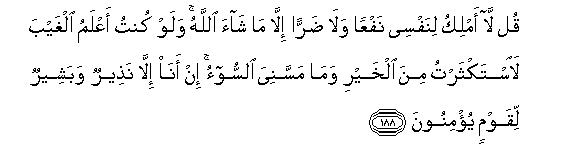

# قُلْ لَا أَمْلِكُ لِنَفْسِي نَفْعًا وَلَا ضَرًّا إِلَّا مَا شَاءَ اللَّهُ ۚ وَلَوْ كُنْتُ أَعْلَمُ الْغَيْبَ لَاسْتَكْثَرْتُ مِنَ الْخَيْرِ وَمَا مَسَّنِيَ السُّوءُ ۚ إِنْ أَنَا إِلَّا نَذِيرٌ وَبَشِيرٌ لِقَوْمٍ يُؤْمِنُونَ 

##Qul la amliku linafsee nafAAan wala darran illa ma shaa Allahu walaw kuntu aAAlamu alghayba laistakthartu mina alkhayri wama massaniya alssoo-o in ana illa natheerun wabasheerun liqawmin yu/minoona 

## 翻译(Translation)：

| Translator | 译文(Translation)                                            |
| :--------: | ------------------------------------------------------------ |
|    马坚    | 你说：除真主所意欲的外，我不能掌握自己的祸福。假若我能知幽玄，我必多谋福利，不遭灾殃了。我只是一个警告者和对信道的民众的报喜者。 |
|  YUSUFALI  | Say: "I have no power over any good or harm to myself except as Allah willeth. If I had knowledge of the unseen, I should have multiplied all good, and no evil should have touched me: I am but a warner, and a bringer of glad tidings to those who have faith." |
| PICKTHALL  | Say: For myself I have no power to benefit, nor power to hurt, save that which Allah willeth. Had I knowledge of the Unseen, I should have abundance of wealth, and adversity would not touch me. I am but a warner, and a bearer of good tidings unto folk who believe. |
|   SHAKIR   | Say: I do not control any benefit or harm for my own soul except as Allah please; and had I known the unseen I would have had much of good and no evil would have touched me; I am nothing but a warner and the giver of good news to a people who believe. |

---

## 对位释义(Words Interpretation)：

| No   | العربية | 中文    | English | 曾用词 |
| ---- | ------: | ------- | ------- | ------ |
| 序号 |    阿文 | Chinese | 英文    | Used   |
| 7:188.1  | قُلْ       | 你说           | Say                     | 见2:80.8   |
| 7:188.2  | لَا       | 不，不是，没有 | no                      | 见2:2.3    |
| 7:188.3  | أَمْلِكُ     | 我控制         | I have control          | 见5:25.5   |
| 7:188.4  | لِنَفْسِي    | 为我自己       | for myself              | 参5:25.7   |
| 7:188.5  | نَفْعًا     | 裨益           | benefit                 | 见4:11.63  |
| 7:188.6  | وَلَا      | 也不           | and not                 | 见1:7.8    |
| 7:188.7  | ضَرًّا      | 祸             | harm                    | 见5:76.10  |
| 7:188.8  | إِلَّا      | 除了           | Except                  | 见2:9.7    |
| 7:188.9  | مَا       | 什么           | what/ that which        | 见2:17.8   |
| 7:188.10 | شَاءَ      | 意欲           | Will                    | 见2:20.15  |
| 7:188.11 | اللَّهُ     | 安拉，真主     | Allah                   | 见2:7.2    |
| 7:188.12 | وَلَوْ      | 和如果         | and if                  | 见2:20.14  |
| 7:188.13 | كُنْتُ      | 我是           | I was                   | 见4:73.15  |
| 7:188.14 | أَعْلَمُ     | 至知           | know best               | 见2:30.25  |
| 7:188.15 | الْغَيْبَ    | 幽玄           | the unseen              | 见6:50.10  |
| 7:188.16 | لَاسْتَكْثَرْتُ | 必定我多谋     | I should have abundance |            |
| 7:188.17 | مِنَ       | 从             | from                    | 见2:19.3   |
| 7:188.18 | الْخَيْرِ    | 善良           | goodness                | 见3:104.6  |
| 7:188.19 | وَمَا      | 和不           | and not                 | 见2:9.9    |
| 7:188.20 | مَسَّنِيَ     | 它接触我       | it have touched me      |            |
| 7:188.21 | السُّوءُ    | 祸             | evil                    |            |
| 7:188.22 | إِنْ       | 不             | no                      | 见4:62.12  |
| 7:188.23 | أَنَا      | 我             | I                       | 见2:258.21 |
| 7:188.24 | إِلَّا      | 除了           | Except                  | 见2:9.7    |
| 7:188.25 | نَذِيرٌ     | 一个警告者     | a warner                | 见7:184.10 |
| 7:188.26 | وَبَشِيرٌ    | 和报喜者       | and cheer               | 参5:19.23  |
| 7:188.27 | لِقَوْمٍ     | 对人们         | For the people          | 见2:118.23 |
| 7:188.28 | يُؤْمِنُونَ   | 他们确信       | they believe            | 见2:3.2    |

---