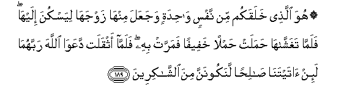

# ۞ هُوَ الَّذِي خَلَقَكُمْ مِنْ نَفْسٍ وَاحِدَةٍ وَجَعَلَ مِنْهَا زَوْجَهَا لِيَسْكُنَ إِلَيْهَا ۖ فَلَمَّا تَغَشَّاهَا حَمَلَتْ حَمْلًا خَفِيفًا فَمَرَّتْ بِهِ ۖ فَلَمَّا أَثْقَلَتْ دَعَوَا اللَّهَ رَبَّهُمَا لَئِنْ آتَيْتَنَا صَالِحًا لَنَكُونَنَّ مِنَ الشَّاكِرِينَ 

##Huwa allathee khalaqakum min nafsin wahidatin wajaAAala minha zawjaha liyaskuna ilayha falammataghashshaha hamalat hamlan khafeefan famarrat bihi falamma athqalat daAAawa Allaha rabbahuma la-in ataytanasalihan lanakoonanna mina alshshakireena 

## 翻译(Translation)：

| Translator | 译文(Translation)                                            |
| :--------: | ------------------------------------------------------------ |
|    马坚    | 他从一个人创造你们，他使那个人的配偶与他同类，以便他依恋她。他和她交接后，她怀了一个轻飘飘的孕，她能照常度日，当她感觉身子重的时候，他俩祈祷真主--他俩的主--说：如果你赏赐我们一个健全的儿子，我们一定感谢你。 |
|  YUSUFALI  | It is He Who created you from a single person, and made his mate of like nature, in order that he might dwell with her (in love). When they are united, she bears a light burden and carries it about (unnoticed). When she grows heavy, they both pray to Allah their Lord, (saying): "If Thou givest us a goodly child, we vow we shall (ever) be grateful." |
| PICKTHALL  | He it is Who did create you from a single soul, and therefrom did make his mate that he might take rest in her. And when he covered her she bore a light burden, and she passed (unnoticed) with it, but when it became heavy they cried unto Allah, their Lord, saying: If thou givest unto us aright we shall be of the thankful. |
|   SHAKIR   | He it is Who created you from a single being, and of the same (kind) did He make his mate, that he might incline to her; so when he covers her she bears a light burden, then moves about with it; but when it grows heavy, they both call upon Allah, their Lord: If Thou givest us a good one, we shall certainly be of the grateful ones. |

---

## 对位释义(Words Interpretation)：

| No   | العربية | 中文    | English | 曾用词 |
| ---- | ------: | ------- | ------- | ------ |
| 序号 |    阿文 | Chinese | 英文    | Used   |
| 7:189.1  | هُوَ       | 他是           | He is                 | 见2:29.1   |
| 7:189.2  | الَّذِي     | 谁             | who                   | 见2:17.3   |
| 7:189.3  | خَلَقَكُمْ    | 创造了你       | Created you           | 见2:21.7   |
| 7:189.4  | مِنْ       | 从             | from                  | 见2:4.8    |
| 7:189.5  | نَفْسٍ      | 一个人         | one soul              | 见2:48.5   |
| 7:189.6  | وَاحِدَةٍ    | 一个的         | single                | 见4:1.10   |
| 7:189.7  | وَجَعَلَ     | 和他使         | and he make           | 见5:60.15  |
| 7:189.8  | مِنْهَا     | 从它           | From it               | 见2:25.15  |
| 7:189.9  | زَوْجَهَا    | 它的配偶       | its mate              | 见4:1.13   |
| 7:189.10 | لِيَسْكُنَ    | 以便他依恋     | that he might incline |            |
| 7:189.11 | إِلَيْهَا    | 至她           | to her                |            |
| 7:189.12 | فَلَمَّا     | 但是当         | but when              | 见2:17.6   |
| 7:189.13 | تَغَشَّاهَا   | 他交接她       | he covers her         |            |
| 7:189.14 | حَمَلَتْ     | 它粘附         | adheres               | 见6:146.16 |
| 7:189.15 | حَمْلًا     | 一个孕         | a burden              |            |
| 7:189.16 | خَفِيفًا    | 轻的           | light                 |            |
| 7:189.17 | فَمَرَّتْ     | 然后她活动     | then moves            |            |
| 7:189.18 | بِهِ       | 以它           | with it               | 见2:22.13  |
| 7:189.19 | فَلَمَّا     | 但是当         | but when              | 见2:17.6   |
| 7:189.20 | أَثْقَلَتْ    | 它变重         | it grows heavy        |            |
| 7:189.21 | دَعَوَا     | 他俩祈祷       | they both pray        |            |
| 7:189.22 | اللَّهَ     | 安拉，真主     | Allah                 | 见2:9.2    |
| 7:189.23 | رَبَّهُمَا    | 他俩的养主     | their Lord            |            |
| 7:189.24 | لَئِنْ      | 如果           | if                    | 见5:12.16  |
| 7:189.25 | آتَيْتَنَا   | 你给我们       | you give us           |            |
| 7:189.26 | صَالِحًا    | 善功（撒立哈） | good(Salih)           | 见2:62.14  |
| 7:189.27 | لَنَكُونَنَّ   | 我们必定是     | we truly will be      | 见6:63.15  |
| 7:189.28 | مِنَ       | 从             | from                  | 见2:19.3   |
| 7:189.29 | الشَّاكِرِينَ | 众感谢者       | the thankful          | 见3:144.27 |

---